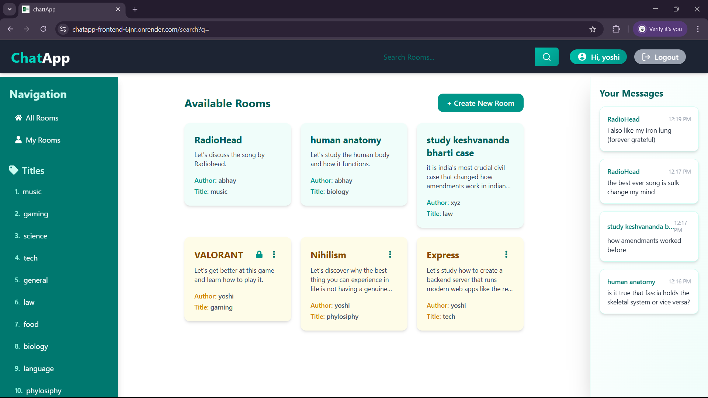
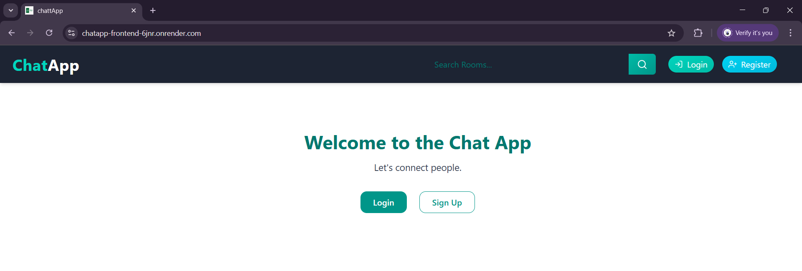

# 💬 ChatApp - MERN Real-Time Chat Application

A full-stack chat application built with the **MERN stack** (MongoDB, Express, React, Node.js) featuring **room-based messaging**, **authentication**, **private rooms**, and a **modern UI**. Deployed on [Render](https://chatapp-frontend-6jnr.onrender.com).

---

## 🚀 Features

- 🔐 User Authentication (JWT + Cookies)
- 🏠 Create & Join Rooms
- 🔒 Private Rooms with Password Access
- 🗨️ Real-Time Room Messaging
- 🧠 Smart UI with Framer Motion Animations
- 📱 Responsive Design for Mobile & Desktop
- 🔍 Search Rooms
- 🧾 Sidebar with Recent Messages
- ⚙️ Role-based Permissions (Host privileges)
- 🧼 Secure Cookie Handling in Production

---

## 📸 Screenshots

| Desktop View | Mobile View |
|--------------|-------------|
|  |  |

---

## 🛠 Tech Stack

### Frontend:
- ⚛️ React 19 + Vite
- 💄 Tailwind CSS
- 🌐 React Router 7
- 🔁 Redux Toolkit + RTK Query
- 🎨 Framer Motion
- 🍞 React Toastify

### Backend:
- 🧠 Node.js + Express
- 🗃️ MongoDB with Mongoose
- 🛡️ JWT Authentication
- 🍪 Cookie-based sessions (secure & same-site handling)
- 🔓 Bcrypt for password hashing
- 🌐 CORS-configured API

---

## 📁 Project Structure

